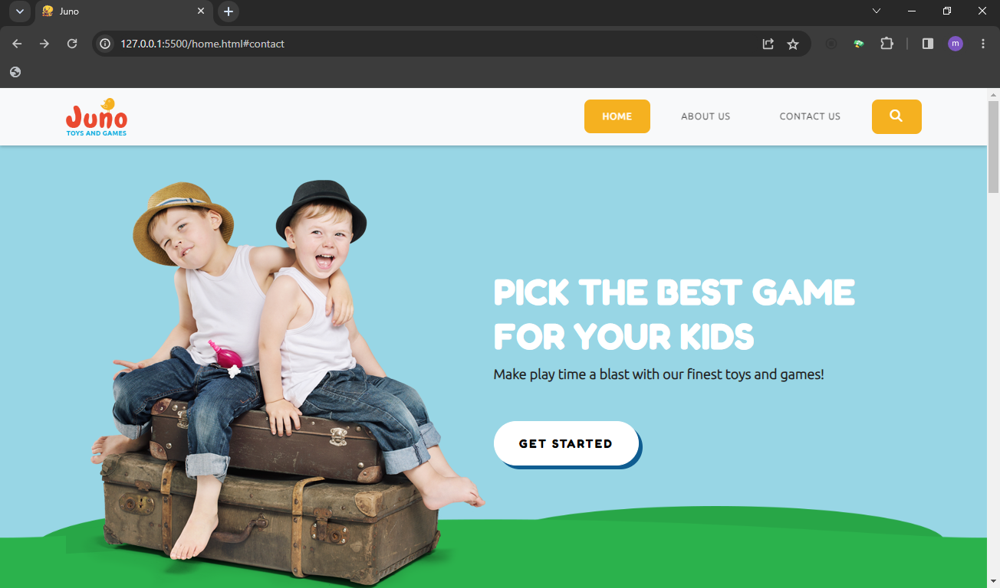
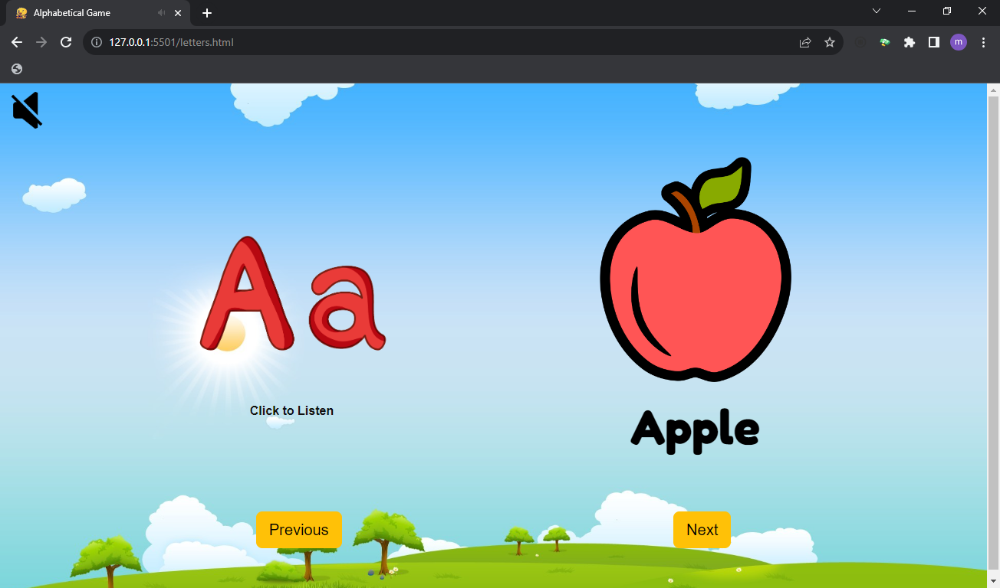

# JUNO

A simple game built with jQuery, JavaScript, and HTML.







## Table of Contents

- [JUNO](#juno)
  - [Table of Contents](#table-of-contents)
  - [Description](#description)
  - [Features](#features)
  - [Installation](#installation)

## Description

Welcome to JUNO, an interactive and educational game built using jQuery, JavaScript, and HTML. Our game is designed to provide an engaging and immersive experience for Kids of all ages, with a focus on learning while having fun.


## Features

- **Interactive Environment:** Create an immersive and visually appealing game world with interactive elements and hidden word-related surprises.

- **Sound Effects and Music:** Enhance the gaming experience with delightful sound effects and background music that adapts to different in-game situations, creating an immersive atmosphere.
  
-  **Adapts to Various Screen Sizes:** Our game features a responsive design that ensures a seamless and enjoyable experience on a wide range of devices, including desktop computers, laptops, tablets, and smartphones. Whether you're playing on a large monitor or a small mobile screen, the game's interface and gameplay remain user-friendly and visually appealing.
  
- **Multiple Choice:** Present a question with multiple answer choices. Kids can select the correct option, making learning fun and engaging.

- **Sorting:** Challenge kids to arrange items or concepts in a specific order, such as sorting historical events chronologically. This feature promotes critical thinking and problem-solving skills.

- **Drag and Drop:** Have kids drag and drop items to their correct locations. For example, they can match countries to their capitals on a map. This interactive element adds an extra layer of interactivity and educational value to the game.

## Installation

1. Clone the repository:

   ```bash
   git clone https://github.com/yourusername/Game-jQuery-JavaScript-HTML.git


